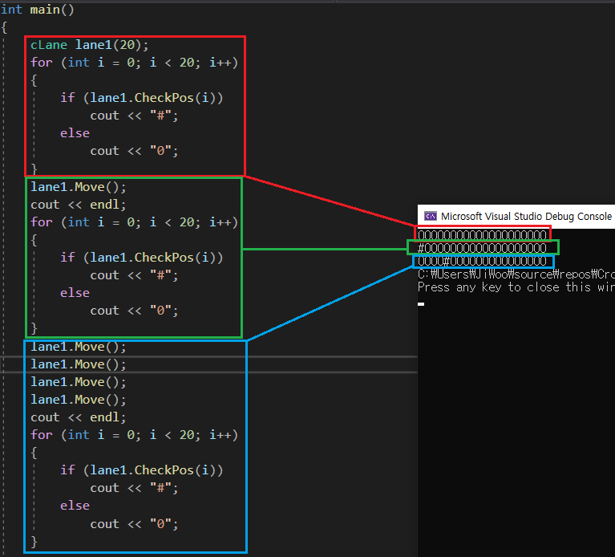
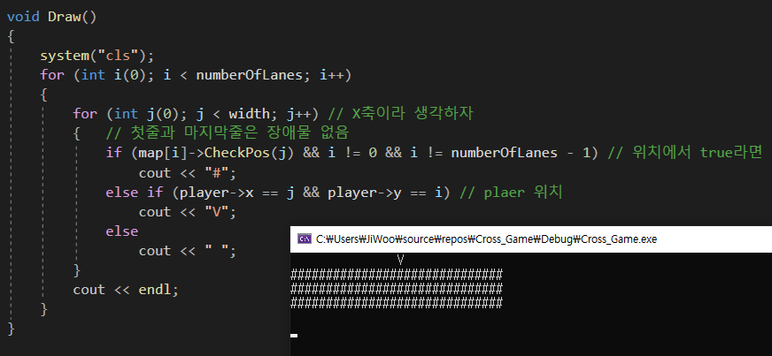

# Cross_Game
 
## 컴퓨터공학 포토폴리오 김지우


**간단한 C++ 연습용 게임 만들기**

## Class 설계
______________________
|Name|State|Behavior|
|:--:|:--:|--|
|**cPlayer**|위치정보(X, Y)| 상단 중심을 시작위치로 |
|**cLane**|장애물정보, 방향정보| 장애물 bool값 반환, 장애물 이동, 장애물 방향변경|
|**cGame**|종료, numberOfLane, 점수, 너비와 폭| 점수계산, 출력문:Draw(), 이동:Input(), 게임논리:Logic(), 실행:Run()|

## mian 내부의 중요 함수 4가지
```C
Draw(); // 화면에 출력하는 함수
Input(); // user의 input을 받아들이고 작용하는
Logic(); // 공의방향지정, paddle의 움직임, 종료조건등 논리부분
Run(); // 실행
```

**cGame_Base설계**


## Move()
```C++
    void Move() // 핵심 자동차 움직이기
    {
        if (right) { // 좌우 결정
            if (rand() % 10 == 1) // 생성한 렌덤수가 1이면 mave car
                cars.push_front(true);
            else
                cars.push_front(false);
            cars.pop_back();
        }
        else {
            if (rand() % 10 == 1) // 생성한 렌덤수가 1이면 mave car
                cars.push_back(true);
            else
                cars.push_back(false);
            cars.pop_front();
        }
    }
```

위의 함수는 장애물들이 random하게 이동하는 것을 구현한 부분입니다.   
if(right) 부분을 통하여 좌우 방향이 달라지도록 하였습니다.   

장애물이 끊임없이 움직이는 것 은 아닙니다.
```C++
if (rand() % 10 == 1)
    cars.push_front(true)
else
    cars.push_front(false);
```

위의 조건문을 통하여 1이 나오는 경우에만 장애물들이 움직이도록 설정하였습니다.   
만약 조건문이 true라면, cars.push_front(true)를 통하여 화면 왼쪽에서 장애물이 추가됩니다.   
따라서 deque 한줄이 전체적으로 오른쪽으로 swift될것 입니다.

**아래 코드를 통하여 Move()의 적용 결과를 확인가능**


## Draw()
전체적인 모습을 그리는 함수

```C++
void Draw()
{
    system("cls");
    for (int i(0); i < numberOfLanes; i++)
    {
        for (int j(0); j < width; j++) // X축이라 생각하자
        {
            if (i == 0 && (j == 0 || j == width - 1)) cout << 'S'; // 시작첫줄
            if (i == numberOfLanes - 1 && (j == 0 || j == width - 1)) cout << 'F'; // 도착줄
                // 첫줄과 마지막줄은 장애물 없음
            if (map[i]->CheckPos(j) && i != 0 && i != numberOfLanes - 1) // 위치에서 true라면
                cout << "#";
            else if (player->x == j && player->y == i) // plaer 위치
                cout << "V";
            else
                cout << " ";
        }
        cout << endl;
    }
    cout << "Score: " << score << endl;
}
```
시작지점(S)과 결승지점(F)에는 장애물을 출력하지 않습니다.

```C++
   if (map[i]->CheckPos(j) && i != 0 && i != numberOfLanes - 1) // 위치에서 true라면
      cout << "#";
```
위의 코드처럼 i, j위치에서 CheckPos를 통하여 bool값을 확인하구, 첫줄과 마지막 줄이 아니라면 장애물이 출력됩니다.



**나머지 간단한 부분은 코드의 주석확인 부탁드립니다**
